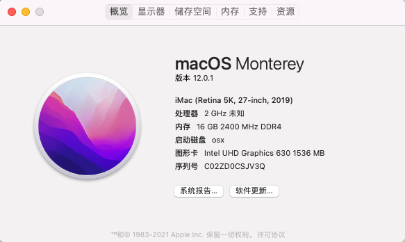

# H410D4-IPC-Hackintosh

##### 这是我自己组装的机器，由于机器还在手中，并作为我的主要业余生产力工具，我会对机器的EFI进行持续的更新，如果你的机器和我的机器的配置相同或者类似，你也可以使用我的EFI文件进行安装使用，当然在使用中如果有优化也可以将它分享给我，共同进步！

### 我的电脑配置：

| 硬件名称 | 型号                   |
| -------- | ---------------------- |
| CPU      | i5-10400Tes            |
| 主板     | 昂达H410D4 IPC ITX主板 |
| 内存     | 酷兽8g2666✖️2           |
| 硬盘     | 凯侠rc10 nvme 512g     |
| 网卡     | Bcm94360cs2            |

#### 我目前的macOS版本是12.0.1

#### 使用的引导工具为OpenCore，使用的版本为0.7.4正式版

intel 酷睿i5-10400T 3wGhz

